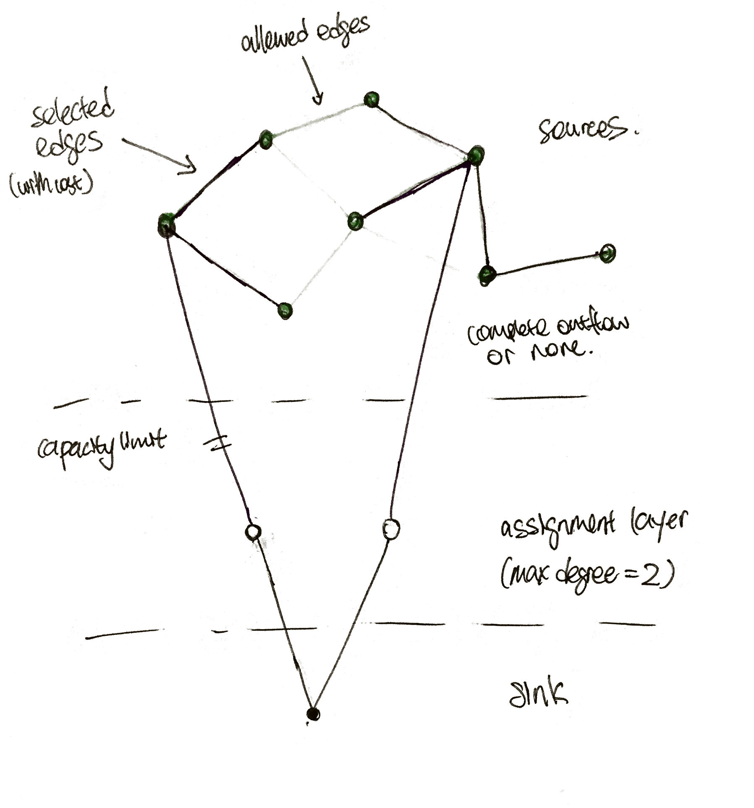

Of course, there are multiple approaches.

Given dataset

### Min cost flows

Each polling district is a source.

### Other resources

Degree constrained spanning tree
https://en.wikipedia.org/wiki/Degree-constrained_spanning_tree

